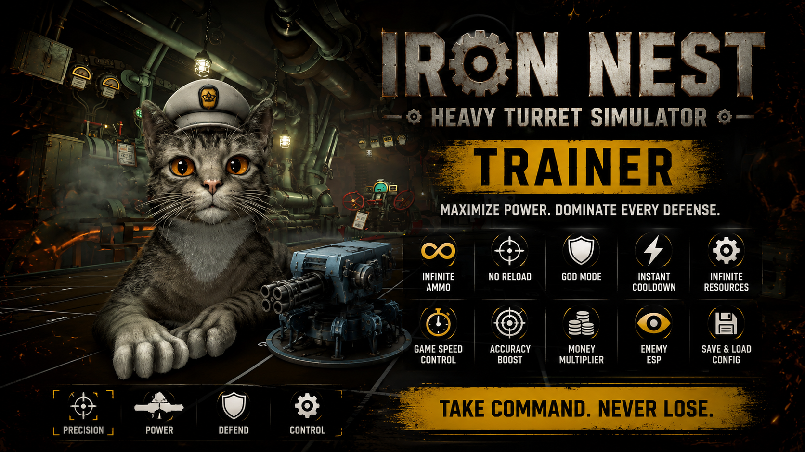
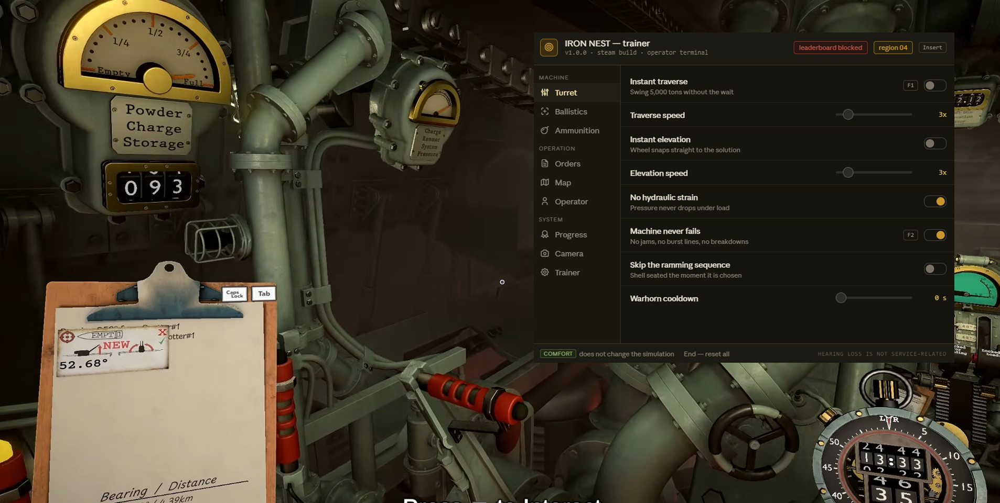

# IRON NEST Trainer — Mod Menu & Cheats for Heavy Turret Simulator (v1.0.0)

**IRON NEST: Heavy Turret Simulator trainer** with an in-game **mod menu** built around the machine itself: auto firing solution, instant traverse, infinite shells, unlock all 30 ammo types and 15 regions, no hearing damage, free camera. Works with the **Steam** release of the dieselpunk artillery sim from Nick Talmers and Dominik Latos. Open the overlay with `Insert`, flip a toggle, keep firing.

> **[⬇ Download the latest IRON NEST trainer](https://github.com/FlintDelivererTube/IRON-NEST-Trainer/releases/latest)**

    

---

## Contents

- [What this is](#what-this-is)
- [Leaderboards and achievements](#leaderboards-and-achievements)
- [Compatibility](#compatibility)
- [Features](#features)
  - [Turret](#turret--machine-control) · [Ballistics](#ballistics--firing-solution-cheats) · [Ammunition](#ammunition) · [Orders](#orders--mission-cheats) · [Map](#map--tactical-map-options) · [Operator](#operator--comfort-and-accessibility) · [Progress](#progress--unlocks) · [Camera](#camera--photo-mode-options) · [Trainer](#trainer-options)
- [Hotkeys](#hotkeys)
- [Installation](#installation)
- [How to use the mod menu](#how-to-use-the-mod-menu)
- [Troubleshooting](#troubleshooting)
- [FAQ](#faq)
- [Changelog](#changelog)
- [Disclaimer](#disclaimer)

---

## What this is

*IRON NEST: Heavy Turret Simulator* puts you inside a 5,000 ton dieselpunk spider-turret in alternate-history Spain, late 1920s, with a republican uprising spreading across the country. Two teleprinters feed you contradictory information — one carries High Command's directives, the other carries calls from the frontline. You take measurements off a tactical map, grind coordinates through a ballistic calculator, pick a propellant charge, haul the elevation wheel, and drag a lever that takes real time to swing that much iron. Then you fire, and the landscape changes.

There's no health bar here. No enemies shooting back at you personally. No levels. So a trainer for this game isn't about survival — it's about **the machine and the maths**. Skip the traverse wait, auto-solve the firing solution, unlock all thirty ammo types, or just turn off the tinnitus and keep everything else honest.

That last part matters more than it sounds. A good chunk of what's in here isn't a cheat at all — it's comfort. Options tagged **comfort** in the menu don't change the simulation; they change whether you can sit through it.

---

## Leaderboards and achievements

IRON NEST has leaderboards and 33 Steam achievements. That's the one place a single-player trainer can spill over onto other people.

**Block leaderboard submission is on by default.** While it's on, no run made with the trainer attached gets sent to the boards. Leave it on. A leaderboard full of auto-solved firing solutions is worthless to everyone competing on it honestly, and the game's whole appeal is that the measurements are hard.

**Block achievement unlocks is off by default**, because achievements are yours alone and nobody else is affected. Turn it on if you'd rather earn all 33 properly and keep a cheated save separate.

Press `End` to reset every option before a run you intend to submit.

---

## Compatibility

| | |
|---|---|
| **Game** | IRON NEST: Heavy Turret Simulator (Nick Talmers & Dominik Latos, released 6 August 2026) |
| **Store** | Steam |
| **OS** | Windows 10 and Windows 11, 64-bit |
| **Runtime** | .NET Desktop Runtime 8 or newer, DirectX 10 |
| **Demo build** | Not supported — the demo runs on a separate app ID |
| **Steam Deck / Proton** | Not supported |
| **Consoles** | No console release |

The game itself is unusually light — it targets 30 FPS at 720p on integrated graphics with 4 GB of RAM. The trainer adds almost nothing on top of that.

---

## Features

    

55+ options across nine tabs, grouped into **Machine**, **Operation** and **System**. Sliders show the shipped default.

### Turret — machine control

| Option | What it does | Hotkey |
|---|---|---|
| **Instant traverse** | Swing 5,000 tons without the wait | `F1` |
| **Traverse speed** | `1x`–`20x`, default `3x` | — |
| **Instant elevation** | Wheel snaps straight to the solution | — |
| **Elevation speed** | `1x`–`20x`, default `3x` | — |
| **No hydraulic strain** | Pressure never drops under load | — |
| **Machine never fails** | No jams, no burst lines, no breakdowns | `F2` |
| **Skip the ramming sequence** | Shell seated the moment it's chosen | — |
| **Warhorn cooldown** | `0`–`30 s`, default `0 s` | — |

Traverse and elevation are separate sliders on purpose. The slow swing is deliberate design — it's the window the game gives you to do everything else, right down to the coffee machine. Plenty of people want faster traverse while keeping manual elevation exactly as it is.

### Ballistics — firing solution cheats

| Option | What it does | Hotkey |
|---|---|---|
| **Auto firing solution** | Coordinates solved the moment they arrive | `F3` |
| **Perfect accuracy** | Every shell lands on the marker | `F4` |
| **Impact prediction** | Draw the arc before you commit | — |
| **No wind drift** | — | — |
| **Auto-match propellant charge** | Charge picked to suit the range | — |
| **Calculator speed** | `1x`–`20x`, default `5x` | — |
| **Reveal true coordinates** | Skip the map measurement entirely | — |

**Reveal true coordinates** is the heaviest option in the trainer and it's off by default. It removes the measurement layer completely — no map work, no cross-referencing intel, no arithmetic. That layer is the reason the game reviews the way it does. Worth seeing once to understand what it's doing; not worth leaving on.

### Ammunition

| Option | What it does | Hotkey |
|---|---|---|
| **Infinite shells** | Every type, never depleted | `F5` |
| **Instant reload** | — | — |
| **Unlock all 30 ammo types** | The full catalogue immediately | — |
| **Blast radius** | `1x`–`10x`, default `1x` | — |
| **Shell damage multiplier** | `1x`–`50x`, default `3x` | — |
| **Weightless shells** | Haul without the animation | — |
| **Gas and smoke persistence** | `1x`–`10x`, default `1x` | — |

### Orders — mission cheats

| Option | What it does | Hotkey |
|---|---|---|
| **Freeze the mission timer** | High Command can wait | `F6` |
| **No penalty for disobeying** | Ignore directives without consequence | — |
| **Always maximum rating** | Every operation scores top marks | — |
| **Reveal frontline calls early** | See the second teleprinter in advance | — |
| **Instant aerial photo** | Reconnaissance returns immediately | — |
| **Skip the briefing** | — | — |
| **Objectives per operation** | `1`–`12`, default `4` | — |

**No penalty for disobeying** deserves a note. The tension between High Command's orders and what the frontline is actually telling you is the game's central choice — and the story is built on the fact that those choices cost something. Switching the cost off doesn't make you free; it makes the campaign inert.

### Map — tactical map options

| Option | What it does | Hotkey |
|---|---|---|
| **Reveal the full map** | Every region uncovered | `F8` |
| **Show enemy positions** | Live markers on the tactical map | `F7` |
| **Show previous impacts** | Every scar you've left behind | — |
| **Auto-plot coordinates** | Markers placed from intel automatically | — |
| **Marker snap precision** | `1`–`10`, default `1` | — |
| **Grid overlay** | — | — |

### Operator — comfort and accessibility

| Option | What it does | Tag |
|---|---|---|
| **No hearing damage** | Tinnitus and muffling disabled | comfort |
| **No recoil shake** | The floor stops moving under you | comfort |
| **Movement speed** | `1x`–`8x`, default `2x` | — |
| **Instant interaction** | Levers and dials respond without animation | — |
| **Infinite coffee** | The machine on your desk never runs dry | comfort |
| **Cat always nearby** | She finds you between shots | comfort |

The game jokes about military-grade hearing loss, and the tinnitus effect is a real part of the atmosphere. For some people it's the best thing in the game and for others it's the reason they refunded it. **No hearing damage** and **No recoil shake** exist for the second group, and they don't touch the simulation at all — you still have to do every calculation correctly.

### Progress — unlocks

| Option | What it does |
|---|---|
| **Unlock all 15 regions** | Every region available from the start |
| **Unlock all medals** | Over a hundred of them |
| **Unlock all abilities** | The full ability list |
| **Unlock both challenge modes** | — |
| **Medal progress multiplier** | `1x`–`50x`, default `5x` |
| **Unlock all cat customisation** | Yes, this is a real feature of the game |
| **Score multiplier** | `1x`–`50x`, default `1x` |

Everything in this tab writes persistent data. Back up your save first, and note that **Score multiplier** is exactly the option the leaderboard guard exists to contain.

### Camera & photo mode options

| Option | What it does | Hotkey |
|---|---|---|
| **Field of view** | `60`–`140 deg`, default `90 deg` | — |
| **Free camera** | Step outside the turret entirely | `F9` |
| **Hide interface** | Drop the HUD and all prompts | `F10` |
| **Disable muzzle flash** | — | — |
| **Disable smoke and dust** | — | — |
| **Time of day** | Any hour, default `06:00` | — |
| **Weather** | `Game default`, `Clear`, `Overcast`, `Rain`, `Dust` | — |
| **Extended photo mode** | Filters, depth of field, timescale | — |

Free camera is the one worth having even if you use nothing else. The turret is enormous and you never get to see it from outside during normal play.

### Trainer options

| Option | What it does |
|---|---|
| **Hotkeys** | Global bindings on or off |
| **Menu key** | Rebind the overlay — `Insert`, `F1`, `Home`, `~` |
| **Overlay opacity** | `40%`–`100%`, default `92%` |
| **Block leaderboard submission** | Keep cheated runs off the boards — **on by default** |
| **Block achievement unlocks** | Stop the 33 achievements firing while active |
| **Read-only mode** | Show values, write nothing |
| **Back up saves before writing** | Copy the save folder on first attach |
| **Auto-load profile** | Apply the saved set on launch |

---

## Hotkeys

| Key | Action |
|---|---|
| `Insert` | Open or close the mod menu |
| `F1` | Instant traverse |
| `F2` | Machine never fails |
| `F3` | Auto firing solution |
| `F4` | Perfect accuracy |
| `F5` | Infinite shells |
| `F6` | Freeze the mission timer |
| `F7` | Show enemy positions |
| `F8` | Reveal the full map |
| `F9` | Free camera |
| `F10` | Hide interface |
| `End` | Reset every option |
| `↑ ↓ ← → Enter` | Navigate the menu without a mouse |

---

## Installation

1. **Download** the latest archive from the [Releases page](https://github.com/[YOUR-USERNAME/iron-nest-trainer](https://github.com/FlintDelivererTube/IRON-NEST-Trainer)/releases/latest).
2. **Unblock it** — right-click the `.zip`, choose Properties, tick *Unblock*, then Apply. Windows quarantines downloaded archives and the trainer won't attach otherwise.
3. **Extract** anywhere outside `Program Files`.
4. **Launch the game first** and load into an operation, so the process exists.
5. **Run the trainer as administrator.** The header should read `attached` with your current region.
6. **Press `Insert`.**

Back up your save before the first run. The game uses Steam Cloud, so a bad local write can sync upward — turn Cloud off for the game while you experiment. Save data typically sits under `%USERPROFILE%\AppData\LocalLow`, in the developer's folder; check your install for the exact path, since it can differ between builds.

---

## How to use the mod menu

Pick a tab on the left, flip what you need on the right. Sliders update live.

A few setups worth knowing:

- **Comfort only, no cheating:** `No hearing damage` + `No recoil shake` + `Field of view 100`. Everything else stock. The simulation is untouched and you still have to earn every hit.
- **Learning the ballistics:** `Impact prediction` + `Machine never fails`, with the calculator left manual. You see where the arc lands, so a wrong charge teaches you something instead of just wasting a shell.
- **Faster operations:** `Traverse speed 8x` + `Instant elevation` + `Instant reload`. Keeps the maths, cuts the waiting.
- **Seeing the machine:** `Free camera` + `Hide interface` + `Time of day 06:00`. The turret from outside at dawn is the shot everyone wants.
- **Content unlock:** `Unlock all 15 regions` + `Unlock all 30 ammo types`. Back up your save first, and leave the leaderboard guard on.

---

## Troubleshooting

**Mouse cursor disappears after alt-tabbing.** That's a known issue in the game itself, not the trainer — it happens during intros, cinematics and scene transitions. Alt-tab out and back in, or open and close the mod menu with `Insert`.

**Turret position or mission events didn't reset when I replayed a mission.** Also a known game-side issue with mission replays. Restart the operation from the main menu rather than the retry prompt.

**Trainer says the process wasn't found.** The game has to be running and loaded into an operation. Launch IRON NEST, get into a mission, then start the trainer.

**Nothing happens when I press Insert.** Another overlay is eating the key. Steam's overlay, Discord and RTSS are the usual suspects. Rebind under **Trainer → Menu key**.

**Ballistics options do nothing from the main menu.** Firing-solution memory is allocated when an operation loads. Get into a mission first.

**My unlocks disappeared after a game update.** Progress-tab options write persistent data that a patch can invalidate. Restore the backup the trainer made on first attach.

**Windows Defender flagged it.** Trainers read and write another process's memory, which is what a lot of malware also does, so heuristic scanners flag them on principle. Add an exclusion if you're comfortable with that — and if you'd rather not, don't. That's a reasonable call.

**I only have the demo.** The demo is a separate app ID and isn't supported.

---

## FAQ

### Will I get banned for using cheats in IRON NEST?

It's a single-player game with no anti-cheat and no multiplayer, so there's nothing to be banned from. The leaderboards are the only shared surface, which is why submission is blocked by default.

### Does the trainer affect leaderboards?

Not while **Block leaderboard submission** is on, which is the default. Turn it off only if you're playing entirely stock and want your legitimate runs to count.

### Do Steam achievements still unlock?

Yes, unless you turn on **Block achievement unlocks** in the Trainer tab. All 33 are awarded locally.

### Can I turn off the tinnitus and hearing damage?

Yes — **No hearing damage** in the Operator tab, along with **No recoil shake**. Neither changes the simulation, so you can use them and still play the game as intended.

### Is there a free camera mod for IRON NEST?

Yes, in the Camera tab, with FOV control and a HUD toggle alongside it. The turret is worth looking at from the outside.

### Does it work on the demo?

No. The demo runs on a separate app ID and isn't supported.

### Does it work on Steam Deck or Linux?

No. Windows only. Proton changes how the game's memory is laid out.

### Will it corrupt my save?

The Progress tab writes persistent data — regions, medals, abilities, challenge modes. That's why the trainer backs up on first attach and why it's worth turning off Steam Cloud while you experiment. Everything else is runtime-only and leaves nothing behind.

### How do I turn everything off?

Press `End`.

### Does it have unlimited ammo?

Yes, plus instant reload, weightless shells and all thirty ammo types, in the Ammunition tab.

---

## Changelog

### v1.0.0 — 11 August 2026

First public release. 55+ options across Turret, Ballistics, Ammunition, Orders, Map, Operator, Progress, Camera and Trainer. Leaderboard guard on by default; comfort options separated from cheats so you can use one without the other.

Full history on the [Releases page](https://github.com/FlintDelivererTube/IRON-NEST-Trainer/releases).

---

## Disclaimer

Unofficial fan tool. **Not affiliated with, endorsed by, or connected to Nick Talmers, Dominik Latos, Code Horizon, PlayWay or Valve.** *IRON NEST: Heavy Turret Simulator* and all related names and assets belong to their respective owners.

Intended for single-player use on your own copy. Leave the leaderboard guard on. Modifying a running game's memory carries some risk of crashes and save corruption — back up your save, and use it at your own risk.

Released under the [MIT License](LICENSE).

---

IRON NEST trainer · IRON NEST Heavy Turret Simulator cheats · IRON NEST mod menu for PC · auto firing solution, instant traverse, infinite shells, unlock all ammo types and regions, no hearing damage, free camera · Steam · dieselpunk heavy artillery simulator · Nick Talmers and Dominik Latos
